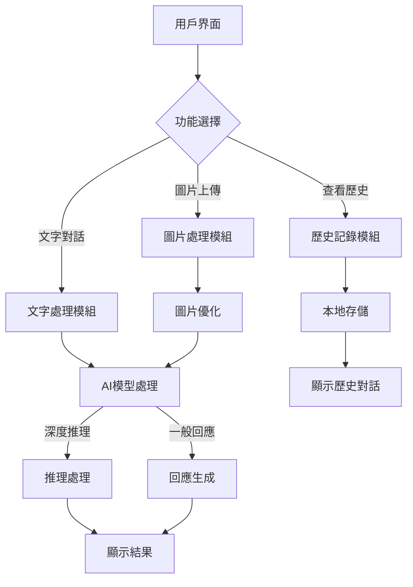
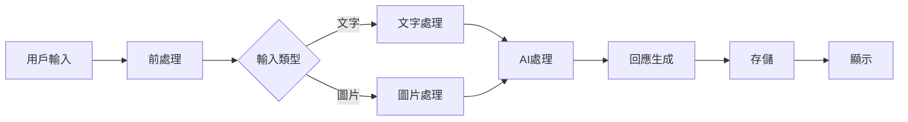

# ChatBOT聊天機器人助手

這是一個基於 Flask 的聊天應用，使用 Mistral AI 的模型提供智能對話功能，支援文字和圖片互動。

## 功能特點

- 與 Mistral AI 模型進行文字對話
- 支援上傳圖片進行視覺分析和對話
- 支援多種圖片格式：PNG, JPG, JPEG, GIF, WEBP, BMP, TIFF, SVG
- 圖片自動調整尺寸和優化品質，提供多種尺寸和品質選項
- 儲存對話歷史記錄到本地
- 查看和恢復歷史對話
- 美觀的使用者介面，回應式設計

## `Make`&`n8n`自動化工作流程

本專案包含兩個主要工作流程：

### 1. OneDrive資料同步工作流程


### 2. LINE聊天機器人工作流程

```mermaid
graph LR
    A[接收make觸發] --> B[儲存使用者提問]
    B --> C[獨立產生sessionId]
    C --> D[超級智慧機器人]
    D --> E[回傳到LINE]
    
    D --> F[向量資料庫-LINE]
    D --> G[Groq Chat Model]
    D --> H[暫存記憶體]
    D --> I[tavily工具呼叫]
    D --> J[tavily工具使用]
    
    F --> K[向量嵌入-LINE]
    K --> L[向量嵌入]
    G --> E
    
    style A fill:#4B89DC
    style B fill:#967ADC
    style C fill:#F6BB42
    style D fill:#37BC9B
    style E fill:#4B89DC
    style F fill:#3BAFDA
    style G fill:#DA4453
    style H fill:#967ADC
    style I fill:#434A54
    style J fill:#434A54
    style K fill:#37BC9B
    style L fill:#967ADC
```



這兩個工作流程分別處理：

1. **OneDrive資料同步工作流程**
   - 自動化資料擷取和處理
   - 文件格式轉換和標準化
   - 向量資料庫整合
   - 資料分割和嵌入處理

2. **LINE聊天機器人工作流程**
   - 使用者互動處理
   - 智能對話生成
   - 向量資料庫查詢和整合
   - 多工具協同運作

## AI 智慧聊天應用機器人-系統流程圖



### 主要流程說明

1. **用戶界面層**
   - 提供文字輸入介面
   - 支援圖片上傳功能
   - 歷史記錄查看選項

2. **處理層**
   - 文字處理：清理和格式化用戶輸入
   - 圖片處理：調整大小和優化品質
   - AI模型整合：
     - 串接`Mistral AI`進行圖片分析
     - 串接`node deepresearch`進行深度推理
     - 串接`MCP Server`相關應用，如`Tavily`AI即時網頁搜尋
3. **存儲層**
   - 本地對話歷史記錄
   - 圖片暫存管理
   - 配置文件管理

### 資料流程



## 安裝

1. 克隆儲存庫或下載原始碼
2. 安裝相依套件
```bash
pip install -r requirements.txt
```

## 設定

在執行應用前，需要設定 Mistral AI 的 API 金鑰。您可以在 https://console.mistral.ai/home 註冊並獲取 API 金鑰。

有兩種方式設定 API 金鑰:

1. 設定環境變數:
```bash
export MISTRAL_API_KEY=your_api_key_here
```

2. 在 `config.py` 檔案中直接設定:
```python 
MISTRAL_API_KEY = "your_api_key_here"
```

## 執行應用

```bash
cd mistral-flask-app
python run.py
```

應用將在本地執行，訪問 http://127.0.0.1:5000/ 開始使用。

## 目錄結構

```
deep-reasearch-chatbot/
├── app.py            # Flask應用主文件
├── run.py            # 啟動腳本
├── config.py         # 配置文件
├── requirements.txt  # 依賴列表
├── static/           # 靜態資源
│   ├── css/          # CSS樣式文件
│   ├── js/           # JavaScript文件
│   └── uploads/      # 上傳的圖片儲存
├── templates/        # HTML模板
│   ├── index.html    # 主聊天頁面
│   └── history.html  # 歷史記錄頁面
└── data/             # 數據儲存
    └── conversations/ # 對話歷史記錄
```

## 使用方法

1. 在聊天輸入框中輸入文字進行對話
2. 點擊圖片按鈕上傳圖片進行視覺分析
3. 上傳圖片時可以選擇圖片尺寸（原始、小、中、大）和品質（低、中、高）
4. 點擊"歷史記錄"按鈕查看過去的對話
5. 點擊"新對話"按鈕開始一個新的對話
6. 點擊"啟用深度推理"即可進行深度推理分析
7. 點擊"啟用搜尋模式"即可進行即時搜尋結果
8. 直接提問則可進行RAG知識庫進行問答

## 注意事項

- 對話歷史記錄保存在本地 `data/conversations` 目錄中
- 上傳的圖片暫存在 `static/uploads` 目錄中 

## 許可證

本項目採用MIT許可證。詳情請見LICENSE文件。